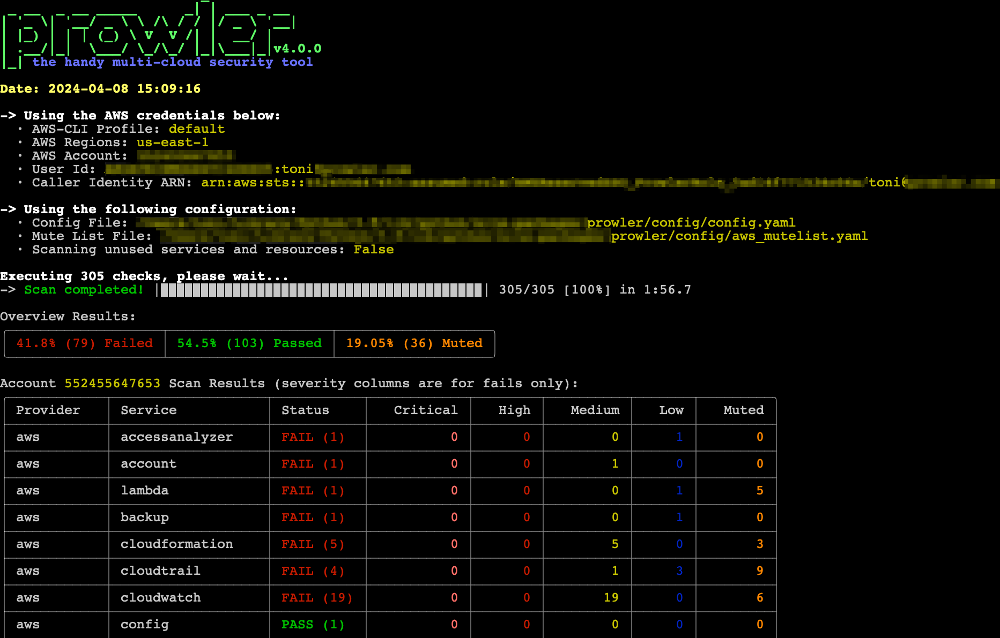
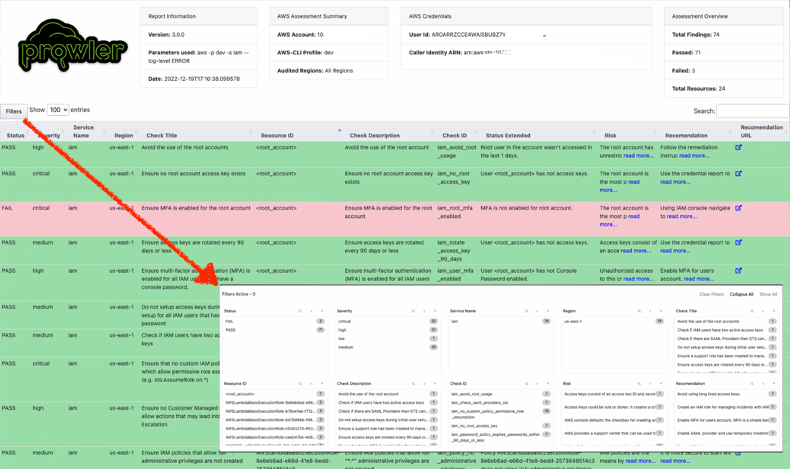

<p href="https://github.com/prowler-cloud/prowler">

</p>
<br>

# Prowler Documentation

**Welcome to [Prowler Open Source v3](https://github.com/prowler-cloud/prowler/) Documentation!** 📄

For **Prowler v2 Documentation**, please go [here](https://github.com/prowler-cloud/prowler/tree/2.12.0) to the branch and its README.md.

- You are currently in the **Getting Started** section where you can find general information and requirements to help you start with the tool.
- In the [Tutorials](tutorials/overview) section you will see how to take advantage of all the features in Prowler.
- In the [Contact Us](contact) section you can find how to reach us out in case of technical issues.
- In the [About](about) section you will find more information about the Prowler team and license.

## About Prowler

**Prowler** is an Open Source security tool to perform AWS and Azure security best practices assessments, audits, incident response, continuous monitoring, hardening and forensics readiness.

It contains hundreds of controls covering CIS, PCI-DSS, ISO27001, GDPR, HIPAA, FFIEC, SOC2, AWS FTR, ENS and custom security frameworks.

[](https://twitter.com/prowlercloud)

## About ProwlerPro

<a href="https://prowler.pro"></a> **ProwlerPro** gives you the benefits of Prowler Open Source plus continuous monitoring, faster execution, personalized support, visualization of your data with dashboards, alerts and much more.
Visit <a href="https://prowler.pro">prowler.pro</a> for more info.


## Quick Start
### Installation

Prowler is available as a project in [PyPI](https://pypi.org/project/prowler-cloud/), thus can be installed using pip with `Python >= 3.9`:


=== "Generic"

    _Requirements_:

    * `Python >= 3.9`
    * `Python pip >= 3.9`
    * AWS and/or Azure credentials

    _Commands_:

    ``` bash
    pip install prowler
    prowler -v
    ```

=== "Docker"

    _Requirements_:

    * Have `docker` installed: https://docs.docker.com/get-docker/.
    * AWS and/or Azure credentials
    * In the command below, change `-v` to your local directory path in order to access the reports.

    _Commands_:

    ``` bash
    docker run -ti --rm -v /your/local/dir/prowler-output:/home/prowler/output \
    --name prowler \
    --env AWS_ACCESS_KEY_ID \
    --env AWS_SECRET_ACCESS_KEY \
    --env AWS_SESSION_TOKEN toniblyx/prowler:latest
    ```

=== "Ubuntu"

    _Requirements for Ubuntu 20.04.3 LTS_:

    * AWS and/or Azure credentials
    * Install python 3.9 with: `sudo apt-get install python3.9`
    * Remove python 3.8 to avoid conflicts if you can: `sudo apt-get remove python3.8`
    * Make sure you have the python3 distutils package installed: `sudo apt-get install python3-distutils`
    * To make sure you use pip for 3.9 get the get-pip script with: `curl https://bootstrap.pypa.io/get-pip.py -o get-pip.py`
    * Execute it with the proper python version: `sudo python3.9 get-pip.py`
    * Now you should have pip for 3.9 ready: `pip3.9 --version`

    _Commands_:

    ```
    pip3.9 install prowler
    export PATH=$PATH:/home/$HOME/.local/bin/
    prowler -v
    ```

=== "GitHub"

    _Requirements for Developers_:

    * AWS and/or Azure credentials

    _Commands_:

    ```
    git clone https://github.com/prowler-cloud/prowler
    cd prowler
    poetry shell
    poetry install
    python prowler.py -v
    ```

=== "Amazon Linux 2"

    _Requirements_:

    * AWS and/or Azure credentials
    * Latest Amazon Linux 2 should come with Python 3.9 already installed however it may need pip. Install Python pip 3.9 with: `sudo dnf install -y python3-pip`.
    * Make sure setuptools for python is already installed with: `pip3 install setuptools`

    _Commands_:

    ```
    pip3.9 install prowler
    export PATH=$PATH:/home/$HOME/.local/bin/
    prowler -v
    ```

=== "Brew"

    _Requirements_:

    * `Brew` installed in your Mac or Linux
    * AWS and/or Azure credentials

    _Commands_:

    ``` bash
    brew install prowler
    prowler -v
    ```

=== "AWS CloudShell"

    Prowler can be easely executed in AWS CloudShell but it has some prerequsites to be able to to so. AWS CloudShell is a container running with `Amazon Linux release 2 (Karoo)` that comes with Python 3.7, since Prowler requires Python >= 3.9 we need to first install a newer version of Python. Follow the steps below to successfully execute Prowler v3 in AWS CloudShell:

    _Requirements_:

    * First install all dependences and then Python, in this case we need to compile it because there is not a package available at the time this document is written:
    ```
    sudo yum -y install gcc openssl-devel bzip2-devel libffi-devel
    wget https://www.python.org/ftp/python/3.9.16/Python-3.9.16.tgz
    tar zxf Python-3.9.16.tgz
    cd Python-3.9.16/
    ./configure --enable-optimizations
    sudo make altinstall
    python3.9 --version
    cd
    ```
    _Commands_:

    * Once Python 3.9 is available we can install Prowler from pip:
    ```
    pip3.9 install prowler
    prowler -v
    ```

    > To download the results from AWS CloudShell, select Actions -> Download File and add the full path of each file. For the CSV file it will be something like `/home/cloudshell-user/output/prowler-output-123456789012-20221220191331.csv`

=== "Azure CloudShell"

    _Requirements_:

    * Open Azure CloudShell `bash`.

    _Commands_:

    ```
    pip install prowler
    prowler -v
    ```

## Prowler container versions

The available versions of Prowler are the following:

- `latest`: in sync with master branch (bear in mind that it is not a stable version)
- `<x.y.z>` (release): you can find the releases [here](https://github.com/prowler-cloud/prowler/releases), those are stable releases.
- `stable`: this tag always point to the latest release.

The container images are available here:

- [DockerHub](https://hub.docker.com/r/toniblyx/prowler/tags)
- [AWS Public ECR](https://gallery.ecr.aws/o4g1s5r6/prowler)

## High level architecture

You can run Prowler from your workstation, an EC2 instance, Fargate or any other container, Codebuild, CloudShell, Cloud9 and many more.


## Basic Usage

To run Prowler, you will need to specify the provider (e.g aws or azure):
> If no provider specified, AWS will be used for backward compatibility with most of v2 options.

```console
prowler <provider>
```

> Running the `prowler` command without options will use your environment variable credentials, see [Requirements](getting-started/requirements/) section to review the credentials settings.

If you miss the former output you can use `--verbose` but Prowler v3 is smoking fast, so you won't see much ;)

By default, Prowler will generate a CSV, JSON and HTML reports, however you can generate a JSON-ASFF (used by AWS Security Hub) report with `-M` or `--output-modes`:

```console
prowler <provider> -M csv json json-asff html
```
The html report will be located in the output directory as the other files and it will look like:



You can use `-l`/`--list-checks` or `--list-services` to list all available checks or services within the provider.

```console
prowler <provider> --list-checks
prowler <provider> --list-services
```

For executing specific checks or services you can use options `-c`/`checks` or `-s`/`services`:

```console
prowler azure --checks storage_blob_public_access_level_is_disabled
prowler aws --services s3 ec2
```

Also, checks and services can be excluded with options `-e`/`--excluded-checks` or `--excluded-services`:

```console
prowler aws --excluded-checks s3_bucket_public_access
prowler azure --excluded-services defender iam
```

More options and executions methods that will save your time in [Miscelaneous](tutorials/misc.md).

You can always use `-h`/`--help` to access to the usage information and all the possible options:

```console
prowler --help
```

### AWS

Use a custom AWS profile with `-p`/`--profile` and/or AWS regions which you want to audit with `-f`/`--filter-region`:

```console
prowler aws --profile custom-profile -f us-east-1 eu-south-2
```
> By default, `prowler` will scan all AWS regions.

### Azure

With Azure you need to specify which auth method is going to be used:

```console
# To use service principal authentication
prowler azure --sp-env-auth

# To use az cli authentication
prowler azure --az-cli-auth

# To use browser authentication
prowler azure --browser-auth

# To use managed identity auth
prowler azure --managed-identity-auth
```

More details in [Requirements](getting-started/requirements.md)

Prowler by default scans all the subscriptions that is allowed to scan, if you want to scan a single subscription or various concrete subscriptions you can use the following flag (using az cli auth as example):
```console
prowler azure --az-cli-auth --subscription-ids <subscription ID 1> <subscription ID 2> ... <subscription ID N>
```
