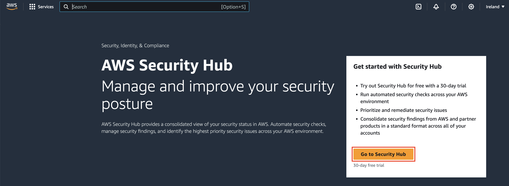
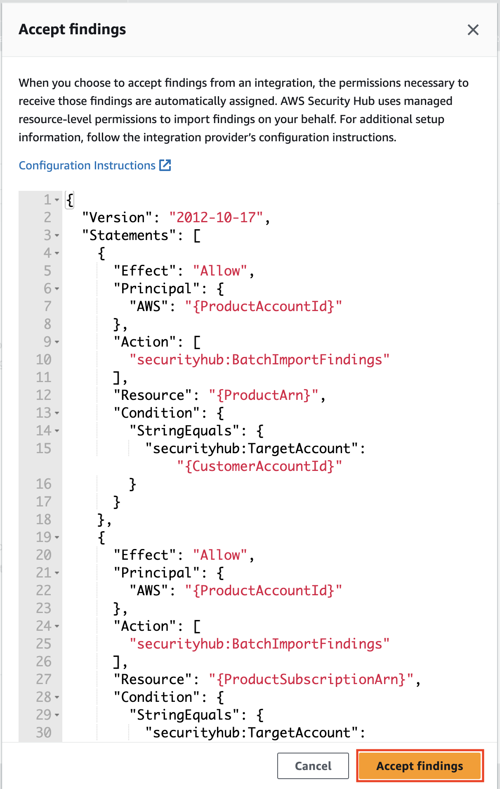
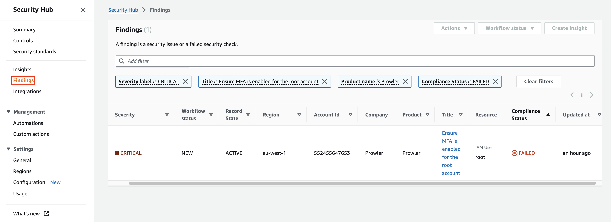
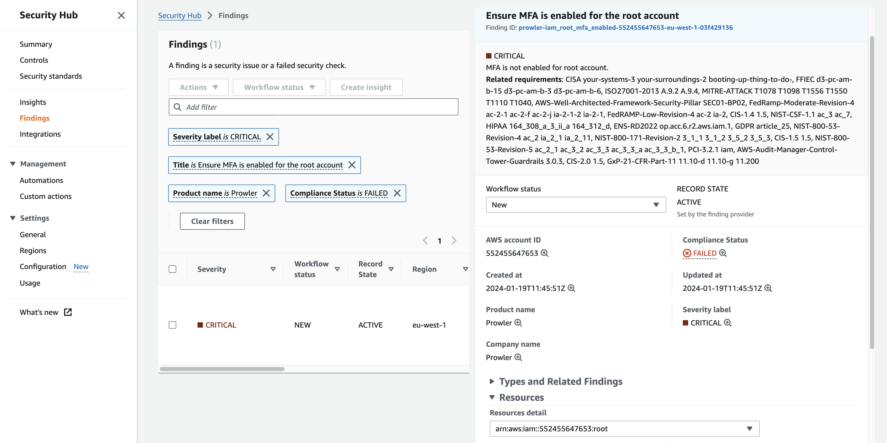

# AWS Security Hub Integration

Prowler supports natively and as **official integration** sending findings to [AWS Security Hub](https://aws.amazon.com/security-hub). This integration allows **Prowler** to import its findings to AWS Security Hub.


Before sending findings, you will need to enable AWS Security Hub and the **Prowler** integration.

## Enable AWS Security Hub

To enable the integration you have to perform the following steps, in _at least_ one AWS region of a given AWS account, to enable **AWS Security Hub** and **Prowler** as a partner integration.

Since **AWS Security Hub** is a region based service, you will need to enable it in the region or regions you require. You can configure it using the AWS Management Console or the AWS CLI.

> Take into account that enabling this integration will incur in costs in AWS Security Hub, please refer to its pricing [here](https://aws.amazon.com/security-hub/pricing/) for more information.

### Using the AWS Management Console

#### Enable AWS Security Hub

If you have currently AWS Security Hub enabled you can skip to the [next section](#enable-prowler-integration).

1. Open the **AWS Security Hub** console at https://console.aws.amazon.com/securityhub/.

2. When you open the Security Hub console for the first time make sure that you are in the region you want to enable, then choose **Go to Security Hub**.


3. On the next page, the Security standards section lists the security standards that Security Hub supports. Select the check box for a standard to enable it, and clear the check box to disable it.

4. Choose **Enable Security Hub**.


#### Enable Prowler Integration

If you have currently the Prowler integration enabled in AWS Security Hub you can skip to the [next section](#send-findings) and start sending findings.

Once **AWS Security Hub** is enabled you will need to enable **Prowler** as partner integration to allow **Prowler** to send findings to your **AWS Security Hub**.

1. Open the **AWS Security Hub** console at https://console.aws.amazon.com/securityhub/.

2. Select the **Integrations** tab in the right-side menu bar.


3. Search for _Prowler_ in the text search box and the **Prowler** integration will appear.

4. Once there, click on **Accept Findings** to allow **AWS Security Hub** to receive findings from **Prowler**.


5. A new modal will appear to confirm that you are enabling the **Prowler** integration.


6. Right after click on **Accept Findings**, you will see that the integration is enabled in **AWS Security Hub**.


### Using the AWS CLI

To enable **AWS Security Hub** and the **Prowler** integration you have to run the following commands using the AWS CLI:

```shell
aws securityhub enable-security-hub --region <region>
```
> For this command to work you will need the `securityhub:EnableSecurityHub` permission.
> You will need to set the AWS region where you want to enable AWS Security Hub.

Once **AWS Security Hub** is enabled you will need to enable **Prowler** as partner integration to allow **Prowler** to send findings to your AWS Security Hub. You have to run the following commands using the AWS CLI:

```shell
aws securityhub enable-import-findings-for-product --region eu-west-1 --product-arn arn:aws:securityhub:<region>::product/prowler/prowler
```
> You will need to set the AWS region where you want to enable the integration and also the AWS region also within the ARN.
> For this command to work you will need the `securityhub:securityhub:EnableImportFindingsForProduct` permission.


## Send Findings
Once it is enabled, it is as simple as running the command below (for all regions):

```sh
prowler aws --security-hub
```

or for only one filtered region like eu-west-1:

```sh
prowler --security-hub --region eu-west-1
```

> **Note 1**: It is recommended to send only fails to Security Hub and that is possible adding `-q/--quiet` to the command. You can use, instead of the `-q/--quiet` argument, the `--send-sh-only-fails` argument to save all the findings in the Prowler outputs but just to send FAIL findings to AWS Security Hub.

> **Note 2**: Since Prowler perform checks to all regions by default you may need to filter by region when running Security Hub integration, as shown in the example above. Remember to enable Security Hub in the region or regions you need by calling `aws securityhub enable-security-hub --region <region>` and run Prowler with the option `-f/--region <region>` (if no region is used it will try to push findings in all regions hubs). Prowler will send findings to the Security Hub on the region where the scanned resource is located.

> **Note 3**: To have updated findings in Security Hub you have to run Prowler periodically. Once a day or every certain amount of hours.

### See you Prowler findings in AWS Security Hub

Once configured the **AWS Security Hub** in your next scan you will receive the **Prowler** findings in the AWS regions configured. To review those findings in **AWS Security Hub**:

1. Open the **AWS Security Hub** console at https://console.aws.amazon.com/securityhub/.

2. Select the **Findings** tab in the right-side menu bar.


3. Use the search box filters and use the **Product Name** filter with the value _Prowler_ to see the findings sent from **Prowler**.

4. Then, you can click on the check **Title** to see the details and the history of a finding.


As you can see in the related requirements section, in the detailed view of the findings, **Prowler** also sends compliance information related to every finding.

## Send findings to Security Hub assuming an IAM Role

When you are auditing a multi-account AWS environment, you can send findings to a Security Hub of another account by assuming an IAM role from that account using the `-R` flag in the Prowler command:

```sh
prowler --security-hub --role arn:aws:iam::123456789012:role/ProwlerExecutionRole
```

> Remember that the used role needs to have permissions to send findings to Security Hub. To get more information about the permissions required, please refer to the following IAM policy [prowler-security-hub.json](https://github.com/prowler-cloud/prowler/blob/master/permissions/prowler-security-hub.json)


## Send only failed findings to Security Hub

When using the **AWS Security Hub** integration you can send only the `FAIL` findings generated by **Prowler**. Therefore, the **AWS Security Hub** usage costs eventually would be lower. To follow that recommendation you could add the `-q/--quiet` flag to the Prowler command:

```sh
prowler --security-hub --quiet
```

You can use, instead of the `-q/--quiet` argument, the `--send-sh-only-fails` argument to save all the findings in the Prowler outputs but just to send FAIL findings to AWS Security Hub:

```sh
prowler --security-hub --send-sh-only-fails
```

## Skip sending updates of findings to Security Hub

By default, Prowler archives all its findings in Security Hub that have not appeared in the last scan.
You can skip this logic by using the option `--skip-sh-update` so Prowler will not archive older findings:

```sh
prowler --security-hub --skip-sh-update
```
